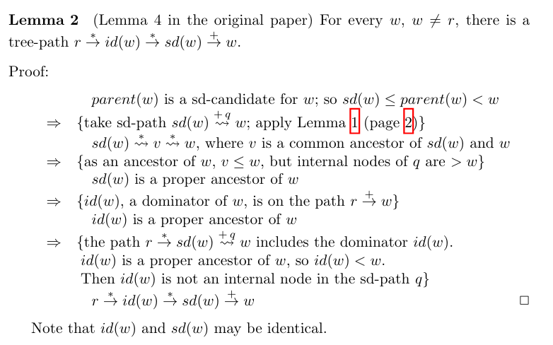
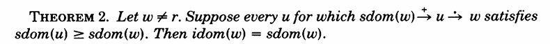
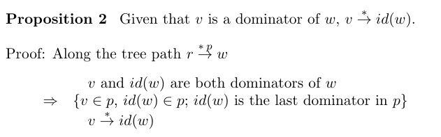
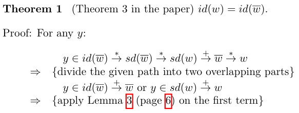
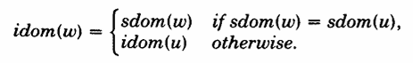
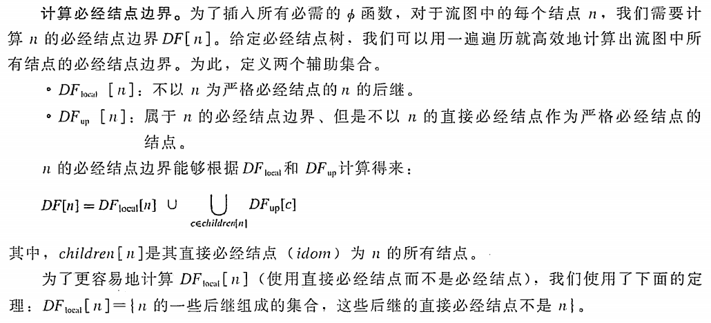

ollvm

# 1.感悟

在认识一个新事物时，一上来就去看很多相关的教程。学了很久，走了很多弯路，愈发觉得自己学习上的低效。但是学习中一旦略有收获，也每每惊叹，在问题的解决过程中，总是蕴含着前人顶级的思维能力，应该多去学思维。

学习中，自己总是在思考为什么。但是回过头来想一想，有时候对于一个普通人来说太有求知欲不是一件好事，求索复杂的问题，往往消耗大量的时间也一无所获。

中学大学时代，我们做题时使用公式定理，并不会关心做题工具本身怎么证明，只是能用来解题就够了。有时候工作、学习中也许也应该这样，太执着于原因也理解不了，不求甚解也是一种好事吧。

# 2.llvm

最近遇到sgmain混淆的问题，刚好借此学习native混淆。看了几篇sgmain的文章，但是功力不够，没有办法还原出jni_onload，遂想到能不能先学习经典的ollvm，先还原出几个so，把反混淆的理念搞清楚，再去研究sgmain这些实战。学习ollvm先要学习llvm。这里我学习的第一篇文章是[《从LLVM到OLLVM学习笔记》](https://whitebird0.github.io/post/%E4%BB%8Ellvm%E5%88%B0ollvm%E5%AD%A6%E4%B9%A0%E7%AC%94%E8%AE%B0.html   )，这篇文章写得很详细，我跟着文章知道了什么是llvm并编译好了llvm项目，然后就开始借助ai继续学习llvm。

## 2.1 llvm架构

LLVM 是一个编译器框架，将编译过程拆分为多个阶段：前端、优化器、中间表示(IR)、后端，每个阶段都模块化设计，便于独立开发和复用。目的是打造一个跨语言、跨平台、模块化且高效的编译器基础设施，简化编译器开发和提升生成代码的性能。


然后很多教程又会讲到clang。我又去了解了一些构建过程的知识。真正把源码编译成目标文件的是编译器clang或者gcc，需要通过命令行来调用

```
clang -c hello.c -o hello.o   # 编译
clang hello.o -o hello         # 链接
```

而ninja和make相当于构建工具，帮助我们编写并执行上面clang、gcc这些指令，比如这是一个ninja脚本

```
rule cc
  command = gcc -c $in -o $out
  description = Compiling $in
rule link
  command = gcc $in -o $out
  description = Linking $out
```

而cmake通过CMakeLists.txt根据平台和选项生成具体的 `Makefile`、`Ninja` 构建文件或其他项目文件。

回到**Clang** 

- Clang 是 LLVM 的 **C、C++、Objective-C 语言前端编译器**。
- 它负责把源代码（如 `.c`、`.cpp` 文件）解析成 LLVM 的中间表示（LLVM IR）。
- Clang 自身基于 LLVM 架构设计，但主要代码实现了前端功能。

用clang编译源码生成了ir中间码就能使用pass对ir进行优化了，混淆也是发生在这一步，所以学习llvm关键就是编写pass


# 3.ir和第一个pass

**学习 LLVM** 的确有两个非常关键的核心：

1. **IR（Intermediate Representation，中间表示）**
2. **Pass（遍历和优化/转换过程）**

### 推荐学习路线

1. 学习基本 C/C++ 代码到 LLVM IR 的转换。
2. 阅读和编写简单的 Pass。
3. 结合实际需求，深入研究 IR 的高级特性和 Pass 的高级用法

我们写一个简单的c代码simple_test.c


我们通过clang -emit-llv就能把.c源代码编译成.ll文件，ll文件中就是IR

```bash
clang -emit-llvm -S simple_test.c -o simple_test.ll
```

看一下IR是怎么样的，类似安卓java转化成smali代码


可以通过PASS来修改IR达到混淆或者优化的目的，那么如何编写一个PASS呢，我们如果去让AI提供学习llvm-pass的入门示例，ai会给我们提供四个文件：Cmakelist.txt、build.sh、test.c、HelloWorld.cpp

第一个是HelloWorld.cpp

```c++
#include "llvm/IR/Function.h"
#include "llvm/IR/Module.h"
#include "llvm/IR/GlobalVariable.h"
#include "llvm/Pass.h"
#include "llvm/Support/raw_ostream.h"
using namespace llvm;
namespace {
struct RenamePass : public ModulePass {
    static char ID;
    RenamePass() : ModulePass(ID) {}
    bool runOnModule(Module &M) override {
        errs() << "=== Function List ===\n";
        for (Function &F : M) {
            errs() << "Function: " << F.getName() << "\n";
            if (F.getName() == "target") {
                F.setName("renamed_target");
                errs() << "→ Renamed 'target' to 'renamed_target'\n";
            }
        }
        errs() << "=== Global Variable List ===\n";
        for (GlobalVariable &G : M.globals()) {
            errs() << "Global: " << G.getName() << "\n";
            if (G.getName() == "gVar") {
                G.setName("renamed_gVar");
                errs() << "→ Renamed 'gVar' to 'renamed_gVar'\n";
            }
        }
        return true; 
    }
};
}
char RenamePass::ID = 0;
static RegisterPass<RenamePass> X("rename", "Rename Target Function and Global Var");

```

第二个是CMakeLists.txt

```cmake
cmake_minimum_required(VERSION 3.13)
project(HelloWorldPass LANGUAGES CXX)
# 设置 LLVM 路径
set(LLVM_DIR /home/test/projects/llvm/llvm-project-llvmorg-14.0.6/build/lib/cmake/llvm)
# 加载 LLVM 配置
find_package(LLVM REQUIRED CONFIG)
message(STATUS "Found LLVM ${LLVM_PACKAGE_VERSION}")
message(STATUS "Using LLVMConfig.cmake in: ${LLVM_DIR}")
# 包含头文件和定义
include_directories(${LLVM_INCLUDE_DIRS})
add_definitions(${LLVM_DEFINITIONS})
# 编译插件为 LLVM loadable module（不要链接 LLVM 静态库）
add_library(HelloWorldPass MODULE HelloWorld.cpp)
# 设置编译属性（LLVM 禁用 RTTI）
set_target_properties(HelloWorldPass PROPERTIES
    COMPILE_FLAGS "-fno-rtti"
    CXX_STANDARD 14
    CXX_STANDARD_REQUIRED ON
)
```

然后是需要被编译成ir的test.c

```c
#include <stdio.h>
int gVar = 42;
void target() {
    printf("Hello from target\n");
}
int main() {
    target();
    printf("gVar = %d\n", gVar);
    return 0;
}
```

最后是build.sh

```sh
#!/bin/sh
# LLVM 构建目录路径（替换为你的实际路径）
LLVM_BUILD_DIR="/home/test/projects/llvm/llvm-project/build"
echo "第1步: 构建 Pass"
rm -rf build
mkdir -p build
cd build
cmake .. -DLLVM_DIR="$LLVM_BUILD_DIR/lib/cmake/llvm"
make
cd ..

echo "第2步: 生成 LLVM IR"
$LLVM_BUILD_DIR/bin/clang -emit-llvm -S simple_test.c -o simple_test.ll

echo "第3步: 运行 Hello World Pass"
echo "--- Pass 输出 ---"
$LLVM_BUILD_DIR/bin/opt -load ./build/libHelloWorldPass.so -rename -enable-new-pm=0 -S simple_test.ll -o simple_test.bc | grep my-pass
$LLVM_BUILD_DIR/bin/clang simple_test.bc -o simple_test
```

执行build.sh脚本，执行完打开simple_test.ll和simple_test.bc，我们发现ir里面的全局变量和函数名称都被加上了前缀rename_


通过这个最简单的示例，我们对这个PASS的作用也有了最直观的了解，就是通过IR来修改指定函数和变量名的名称。当然还能实现更多更复杂的PASS。

我们通过build.sh来了解上面这四个文件的执行过程：

①第一步是通过cmake CMakeLists.txt来生成makefile，我们前面说过，cmake是用来生成makefile，然后make命令即可执行makefile，makefile里面有很多shell指令，把HelloWorldPass.cpp这个我们编写的PASS，编译成libHelloWorldPass.so，这个就是cmakelist中的这一句


然后通过clang为test.c生成ir

最后通过llvm的opt工具来加载libHelloWorldPass.so这个PASS，加载PASS时需要用-rename来使用具体的模块，比如我们在HelloWorldPass.cpp通过RegisterPass来注册的就是rename这个PASS模块


此外，一个so里面可以注册很多个pass模块，这样只需要-xxx就可以使用指定模块来对ir优化，此外也可以直接用llvm自带的pass，非常方便。

总结一下这个过程，通过clang把源码编译成ll文件；写pass并编译成.so，用opt加载so并对ir进行各种操作，因此混淆其实也是编写pass。

原来混淆这么容易，赶紧趁热打铁，让ai再生成几个pass帮助我们学习混淆。通过ai的回答我们知道了，经典的混淆有虚假控制流，指令替换，控制流平坦化等。

ai让我们先学习BogusControlFlowPass，然后把cmake文件改一下add_library(irbuilderPass MODULE BogusControlFlowPass.cpp)


一运行，比对一下，确实有一些FAKE，而且br应该就是一些跳转


反编译发现，上面的示例有点用但是不多，逻辑还是很清楚


再看一下ai生成的pass代码，这些代码应该都是和ir息息相关的，比如获取返回值，创建br指令等等，因为我们在ir中看到了这些


pass相当于提供了对ir操作的封装，如果我们想编写出高质量的pass还是需要对中间码有所理解

# 4.IR入门

再学一下ir相关的知识吧《[LLVM IR入门指南](https://evian-zhang.github.io/llvm-ir-tutorial/#llvm-ir入门指南)》

大概知道了：ir中有一些虚拟寄存器，也有内存变量，但是应该把IR变成SSA形式，就是不能对同一个变量多次赋值，因为SSA有很多好处，便于优化，SSA又和phi指令有关系。

ir就类似于smali、汇编，有各种各样指令，这个很难记完全，看到了查一下就行了。

ir中肯定也有很多数据类型；但是和c系类似，有指针，指针为了运算也能转换成整型；

此外还有结构体、数组，这些聚合类型怎么访问字段呢？如果是内存形式就需要getelementptr


就是通过getelementptr来访问指定的字段


然后是控制流中跳转跳转br i1 %comparison_result, label %A, label %B或无条件跳转br label %labelname

BasicBlock，基本块，我们在pass的代码中也看到过这个词。一个函数由许多基本块组成，每个基本块包含：

- 开头的标签（可省略）
- 一系列指令
- 结尾是终结指令，br、return都是终结指令

然后文章中有一个phi的示例，这个phi指令是为了实现SSA

```c
fn foo(x: i32) {
    let y = if x > 0 { 1 } else { 2 };
    // Do something with y
}
```

用phi就是这样的。`phi`的第一个参数是一个类型，这个类型表示其返回类型为`i32`。接下来则是两个数组，其表示，如果当前的basic block执行的时候，前一个basic block是`%btrue`，那么返回`1`，如果前一个basic block是`%bfalse`，那么返回`2`。

```assembly
define void @foo(i32 %x) {
    %result = icmp sgt i32 %x, 0
    br i1 %result, label %btrue, label %bfalse
btrue:
    br label %end
bfalse:
    br label %end
end:
    %y = phi i32 [1, %btrue], [2, %bfalse]
    ; Do something with %y
    ret void
}

```

# 5.PASS入门

纸上得来终觉浅，绝知此事要躬行。通过前面我们大概知道ir是什么了，同样，作者也提供了一个phi指令的示例，于是我们自己动手去写一个if语句测试一下


上面这个用clang生成为ir看一下


我们发现，ir中是alloca这种内存形式，而不是文章中所说的phi形式，这是怎么一回事呢？原来alloca这种内存变量还要经过一个叫mem2reg的pass进行优化才可以变成phi形式，这个pass是llvm自带的，我们直接用opt加载发现没有输出，优化前后结果也不变。我参考的文章中构建llvm使用的选项是-DCMAKE_BUILD_TYPE=Release


而排除了一些列原因后，发现构建过程中没有配置LLVM_ENABLE_ASSERTIONS=ON，导致没有报错，就很难调试问题。因此还是要看llvm官方的文档去学习。


然后让ai想想办法，ai告诉我们可以自己实现一个mem2reg

```cpp
#include "llvm/Pass.h"
#include "llvm/IR/Function.h"
#include "llvm/IR/BasicBlock.h"
#include "llvm/IR/Instructions.h"
#include "llvm/IR/Dominators.h"
#include "llvm/Transforms/Utils/PromoteMemToReg.h"
#include "llvm/Support/raw_ostream.h"
#include "llvm/IR/LegacyPassManager.h"
#include "llvm/Transforms/IPO/PassManagerBuilder.h"
#include "llvm/Analysis/AssumptionCache.h"
#include <vector>

using namespace llvm;
namespace {
    struct Mem2RegPass : public FunctionPass {
        static char ID;
        Mem2RegPass() : FunctionPass(ID) {}
        bool runOnFunction(Function &F) override {
            if (F.isDeclaration()) return false;
            // 获取必要的分析
            DominatorTree &DT = getAnalysis<DominatorTreeWrapperPass>().getDomTree();
            AssumptionCache &AC = getAnalysis<AssumptionCacheTracker>().getAssumptionCache(F);
            // 收集所有可以被提升的alloca指令
            std::vector<AllocaInst *> Allocas;
            BasicBlock &BB = F.getEntryBlock();
            for (BasicBlock::iterator I = BB.begin(), E = --BB.end(); I != E; ++I) {
                if (AllocaInst *AI = dyn_cast<AllocaInst>(I)) {
                    if (isAllocaPromotable(AI)) {
                        Allocas.push_back(AI);
                    }
                }
            }
            if (Allocas.empty()) {
                errs() << "函数 " << F.getName() << " 中没有可提升的alloca指令\n";
                return false;
            }
            errs() << "函数 " << F.getName() << " 中找到 " << Allocas.size() 
                   << " 个可提升的alloca指令\n";
            // 执行内存到寄存器的提升
            PromoteMemToReg(Allocas, DT, &AC);
            
            errs() << "成功提升了 " << Allocas.size() << " 个alloca指令为PHI节点\n";
            return true;
        }
    };}

char Mem2RegPass::ID = 0;
char Mem2RegAndAnalyzePass::ID = 0;

// 注册Pass
static RegisterPass<Mem2RegPass> X("mem2reg-custom", "Custom Memory to Register Promotion Pass", false, false);
```

我们先不管代码内容，运行一下生成so，再对ll进行优化，竟然真的有效果


我们就来详细学习下mem2reg这个pass，ai生成的这个就是做了两件事

1.收集所有可以被提升的alloca指令

2.执行内存到寄存器的提升

先分析哪些变量应该被提升呢？第一点很好理解，只要变量没有被别的函数使用，或者没有跨函数，那么对这个变量的分析是比较容易的，不用担心有别的函数会修改它。那么我们可能会有个疑问，如果变量存在地址逃逸，分析一下逃逸的地方，不是也能结合起来提升吗？当然函数间优化是有用的，但是一个程序重要的函数只有这么几个，做好函数内部的优化才是程序优化的重点，函数间优化可能需要编译器消耗大量时间分析，得不偿失。第二个是数组、结构体这些也不提升


第二步是把可以提升的进行提升，这一步难理解一点，需要对图论有一定的认识。为什么呢？因为我们看到这个SSA形式的ir中出现了一个phi指令，phi指令应该插入到哪里？数学上证明了是一个支配边界的地方，而求支配边界的操作又涉及到了支配树、半支配节点、DFS生成树等概念。

# 6.pass和图论


控制流图(CFG)就是程序执行的流程图，if或者if块里面执行完要跳转，因此有个箭头，这都很容易理解。

从CFG我们可以对支配有直观的理解，上面的图来自于《现代编译原理》书里把“支配节点”翻译为“必经节点”，但是我们后面都称支配，节点也可以理解成基本块。

把基本块标上序号，可以发现要执行块3必定先执行(必经)块2，执行块7必定先执行块2、3，而5和6只是二选一的情况，不能说其中哪一个是必经的。从图论的角度说，也就是：节点2严格支配节点3；节点2、3严格支配节点7。节点5、6都是7的前驱节点，但不是7的严格支配节点，那么节点5和6的支配边界就都是节点7,支配边界就是前驱但不支配。

执行基本块7必定先经过块3，而执行块3又必定经过块2，很容易发现如果节点A支配节点B，则被节点B支配的必定也被节点A支配。图中离节点7最近的支配节点是3，因此节点3是节点7的直接支配节点。从这支配关系的传递性角度，就很容易看明白画的支配树是什么了，自己学习只要方便自己理解即可。再看一个不同的例子巩固一下，测试一下是不是真的理解了。


从图的角度，怎么容易理解支配边界呢？我们可以看到基本块2和基本块7，都有一个特点，就是有不止一条的进入的路径，那么说明它们更可能是一个合流基本块，合流的基本块多个前驱中都有可能会对该基本块使用的某个变量进行赋值


多值的情况就要插入一个φ函数变成SSA形式，那么是不是所有的合流节点都要插入φ函数呢？其实是不用的，比如这种情况，a和b的值其实是相同的，如果插入φ反而造成性能浪费。究竟哪些合流块要插入φ函数？


只需要在支配边界插入phi指令就行了，而支配边界可以由直接支配节点快速计算。直接支配节点又和支配树有关系，因此mem2reg中会涉及到求CFG的支配树。求支配树这部分和数学理论有些关系，2017年之前的计算方法是SLT算法，现在用的是另一种更容易理解的NCA算法。

## 6.1支配树

那如果能知道每个节点的直接支配节点，也可以马上构建一个支配树，这一点毫无疑问。所以这些算法就是要找出节点的直接支配节点。这里我在看了很多求支配树相关的文章后发现一个问题：理解概念还是过于抽象，比如“半支配节点”以及通过半支配计算直接支配节点，最好把原论文亲自读一遍，跟着作者的思路层层递进。虽然理解证明很难，但是当我们做到能理解每一句话，那算法也并非遥不可及。下面的几篇文章都很好，第一篇清晰明了的介绍了概念和应用，跟着看一遍大概能知道这个计算过程，很通俗易懂，能帮助理解。第2篇主要是几个定理的证明，第3篇是对论文的翻译。我先把文章看了几遍，大概知道怎么回事了。

[编译器中的图论算法](https://www.zhihu.com/tardis/zm/art/365912693?source_id=1005)

[Tarjan的支配树算法 | 山楂片的博客](https://szp15.com/post/tarjan-dominance/)

[支配树求解算法——理论篇 · qwqcxh](https://qaqcxh.github.io/Blogs/graph theory/DominatorTheory.html#5-lengaur-tarjan算法)

这里斗胆结合几篇文章说明一下这个SLT求支配树的算法是怎么回事，大部分图都是别人文章的，证明内容是我自己根据其他文章中的补充，很多文章中的证明对于初学者并不友好，文章某句话可能一下子不容易想明白。CFG就用论文中的这一张，文章1中虽然把节点画重复了，但是已经标出了DFS生成树和直接支配节点不影响理解。仔细看图，我们发现如果一些节点只有一条入边，那就能马上得到直接支配节点，比如C、B、G、L、J等，那么相当于idom能直接知道几个，工程中还是很有用的。


然后是概念，只需要关系祖先、真(完全)祖先这俩都是对于图G的DFS生成树T来说的，因为我在后面发现边叫什么其实没这么重要，因此就不介绍了。而时刻搞清楚定理中某条路径是在说有向图G，还是在说生成树T，这一点反而是至关重要的。有了这条核心脉络，能帮助我们随时随地切换视角，把图上的路径问题转到树上路径或者半支配路径。因为有些定理是对图G来说的，如果图G适用，树和半支配路径自然适用，


知道这些概念就可以看文章3的第一部分，其中引理1、3没有给证明，对于作者确实太过简单无需证明，但是我们没自己证明一次其实也不理解为什么要搞这个引理


这里我们用自己能理解的步骤证明。关键是自己能理解，而非过于学术性的形式证明。

### 6.1.1 引理1

如果v ≤ w，那么从v到w的任意路径都必须经过v和w在DFS树上的共同祖先。

##### 证明

**情况1：v = w** 如果v = w，那么从v到w的路径就是空路径，显然经过它们的共同祖先(节点本身)。这个相等的情况很容易理解

**情况2：v < w** 由于v < w，在DFS过程中v比w更早被访问。根据DFS的性质，当我们访问到w时，必然是通过某个已经访问过的节点到达的。考虑从v到w的任意路径P = v → u₁ → u₂ → ... → uₖ → w 我们需要证明这条路径必须经过v和w的某个共同祖先。设lca(v,w)为v和w在DFS树上的共同祖先。

**若v是w的祖先**

- 如果v是w的祖先，那么lca(v,w) = v
- 任何从v到w的路径都必须从v开始，因此必然经过lca(v,w) = v，结论成立

**若v不是w的祖先**

- v不是w的祖先，那一定不存在v→w且中间节点递增的这种路径。由于v < w，当DFS访问完v的整个子树后，经过回溯才会访问到w
- 这意味着v和w在DFS树中处于不同的子树
- v不是w祖先，那任何从v到w的路径都必须"跳出"v所在的子树，然后"进入"w所在的子树。
- 这样的路径必须经过lca(v,w)


#### 6.1.2 引理3

在控制流图的DFS生成树中，节点w的直接支配节点idom(w)是w在DFS树上的真祖先。

##### 引理3证明过程

反证法：假设idom(w)不是w在DFS树上的祖先。由于idom(w)支配w，从入口节点到w的每条路径都必须经过idom(w)。

在DFS树中，从入口节点到w有一条树路径。由于idom(w)支配w，这条树路径必须经过idom(w)。但如果idom(w)不是w的祖先，那么在DFS树中，从入口节点到w的树路径就不经过idom(w)，这与idom(w)支配w矛盾。因此，idom(w)必须是w在DFS树上的祖先。

由直接支配节点的定义，idom(w)是支配w的节点中除w外最接近w的节点。因此idom(w) ≠ w，所以idom(w)是w的真祖先。

### 6.1.3 引理4


这里找了一篇解释SLT算法的论文，这篇论文中的证明比较好理解。

```
https://www.cs.utexas.edu/~misra/Lengauer+Tarjan.pdf  解释论文
https://dl.acm.org/doi/pdf/10.1145/357062.357071      原论文
```

论文中先介绍了候选半支配节点，任何G中的w节点的前驱都是候选半支配节点；然后如果存在半支配路径，半支配路径就是有向图G上v→w，所有内部节点dfs序号都大于w，半支配的起点v也是一个半支配节点候选者。

所有候选者里面dfs序号最小的那个就是半支配节点。


引理4是关键的一个引理，我们通过解释论文对引理4来进行说明，论文中说存在一个DFS生成树上的路径r *→idom(w) ∗→sdom(w)+→w，这个很难理解，前面我们证明了idom(w)到w在T上必有路径，为什么sdom(w)到w也必有路径呢？下图是解释论文的证明思路


文章的这句话“**parent(w)是sdom-candidate**”，也就是说DFS生成树T上的某个节点w，其父节点parent(w)是w的候选半支配节点，毫无疑问这个是候选半支配节点的定义。并且sdom(w)≤parent(w)＜w，后面parent(w)＜w这个是肯定的，T上父节点必定小于子节点。前面这个sdom(w)≤parent(w)是为什么呢？

sdom定义就是所有半支配候选节点中最小的。假设sdom(w) > parent(w)，那么sdom不是候选半支配节点中最小的，和定义就矛盾了，其实就是sdom要尽量小。那么得出sdom(w) < w后，根据引理1，sdom(w)到w的任意路径上必定经过一个共同祖先v。那么，理论上从sdom(w)到w的任意半支配路径也必须要经过一个共同祖先v。这里就是一个典型的视角切换，图上的定理肯定能用在半支配路径这种特殊的路径上。

这个共同祖先v有可能在半支配路径内部吗？那么根据半支配路径的定义，任何内部节点都要大于w，而v是祖先应该小于w，因此v不可能在半支配路径的内部，那么自然得出了半支配路径的起点sdom(w)是w在树上的祖先。
再总结一下思路：半支配路径也是图上的路径，适用于引理1，sdom(w)<w，因此半支配路径会经过一个共同祖先v。共同祖先的性质是dfs小于子孙，而半支配路径中内部节点大于w，因此半支配路径上共同祖先不是内部节点，只能是sdom(w)。重要的是视角要放在半支配路径上。

然而sdom和idom的关系是怎样的呢？我们考虑这么一条路径，r *→ sdom(w) 到 w，sdom(w)到w是一条半支配路径，内部节点都是大于w的，idom(w)不可能在这里，那么又已知任意路径上都包含idom(w)，那么idom(w)只可能在r *→sdom(w)的树路径上，也就是命题的证。

通过上面论证，颇有一种以大见小的感觉，就是我们要利用比较强的引理来专注于研究sdom(w)、idom(w)、w在树上的关系，而不要去关心图上的关系，因此sdom(w)会有一种精雕细琢的人工感。

从这里，我们才能感觉到sdom，半支配节点是想做什么，也就是想在生成树T上找一个最早可能对w节点有影响的节点，通过定义本身入手去把不在树上的情况排除掉。前面我们证明半支配路径的祖先是sdom(w)时就会发现，通过这样定义会完美满足引理1。此外，我们可以想一下，横叉边必定是右树，就比parent(w)大，就不可能是sdom了，再去找横叉边的父节点，如果又大于说明还在右树上，通过这种递归的思想，也能逐渐找到树上w的祖先节点。通过下面这幅图就容易理解了，半支配路径内部就是右树，右树和w没有什么关联，但是右树的父节点，一定也是左树的父节点，相当于找到了左树内部w在树上的祖先，祖先是有可能的支配节点，因此叫半支配。这个定义的引入就是为了解决问题，这就是工程中想办法解决实际问题的顶级的思维能力。


那么引理4就完整的说明了idom、sdom的关系，就为工程实践铺好了道路。自己简单证一证，虽然可能不严谨。但是没有办法，哪怕只有一句感觉似是而非的地方，都说明自己还没有彻底理解。如果不搞清楚困惑，后面某些步骤就会被小小的困惑所桎梏，当困惑累积的越来越多，学习也难以为继。相反，如果我们用自己的方式理解了困惑，这会成为一种动力。关键还是拨开图上路径的繁杂，着眼于半支配路径和树上的路径。

### 6.1.4 sdom的计算

前面的过程我们只是知道了sdom是什么，sdom有什么性质，那关键是怎么更方便地计算出来sdom呢？

论文中给出了一种方法，半支配路径的起点sdom只可能有两种情况，一个是不含内部节点的半支配路径，也就是w节点的前驱节点，记作sd1；另一种是有内部节点的半支配路径，记作sd2。sd1肯定是存在的，最少有parent(w)，而sd2不一定存在，不管存不存在先记为无穷，那么sdom肯定是min(sd1，sd2)


sd1的情况很好算，只要遍历所有前驱就能得到最小的那一个。sd2的情况，论文中认为是内部节点u，并且这个u的sdom是内部节点中最小的


如果能证明sd2(w)=sd(u)，那就相当于：求存在内部节点的半支配路径上的sd2(w)转化成了求某个内部节点的sdom，就能在代码上实现递归求解


看一下下图作者怎么证明，第一步这个是根据定义。人家定义的就是u是这条路径中dfs序号最小的，没说是sdom最小的，那p肯定大于u，没问题

那根据这个条件，有向图G上sd2(w)→u也是u的一个半支配路径，因为内部节点都会大于u，天然满足半支配路径的定义，这就是为什么要找dfs最小的。知道这个，那么sd(u)<sd2(w)，这个是为什么呢？牢记sd2(w)→u是一个半支配路径

只要是半支配路径，那么半支配节点一定小于等于任意半支配路径上的所有节点，就是和证明sdom(w)小于parent(w)一个道理。如果sdom(u)比sd2(w)大了，那么sd2(w)应该才是u节点的半支配节点sdom(u)，那就和半支配节点的定义矛盾了，因此sdom(u)≤sd2(w)

再看后面，在有向图G上面sd(u)到u的路径中，内部节点都大于u，毫无疑问，这就是半支配路径的定义，不大于就不能成为sdom了，又因为u本身大于w，这个是自带的条件，所以内部节点都大于w，没问题。于是，G上sd(u)→u，然后u到w的这条路径上，所有内部节点都大于w了，sd(u)到w又满足半支配路径的定义，因此sd2(w)小于等于sd(u)，这个是为什么相信不需要再重复说明一次了。

最后已知sd2(w)≤sd(u)，而sd(u)≤sd2(w)，可以发现sdom(u)一定是等于sd2(w)。有趣了，半支配路径上最小的内部节点u，sdom(u)竟然等于sdom(w),把这个结论再增强一下，就是原论文的定理4，也就是脱离了半支配路径，直接是树边和非树边，这样效率还是非常高的。


这个从几何上也很好理解，比如还是那副图，红色都是半支配路径，那么又要大于w，又要找到半支配路径，还是在右树上或者子树上，子树的dfs肯定更大，马上可以排除，右树又要求dfs序号最小的，那么只能是右边最高的u，而右树u半支配节点只能是和w的共同祖先。看到这里我们会发现，半支配这套理论充满着设计感，一旦我们理解了其中奥妙，就会发现这套半支配节点的理论美妙无比。通过DFS来考虑支配关系。同时我们会发现，半支配理论的有效性是来自于约束性，因为从半支配路径的定义来看，这是比较强的约束，内部节点全部要严格大于目标节点，这就过滤掉了大部分的路径。


文章3给出了伪代码，还有些步骤省略了，不过大差不差


然后就是通过半支配节点计算直接支配节点了。

### 6.1.5 idom的计算

#### 引理5，括号引理的证明


对于引理5，论文先证明路径id(v)+→id(w) *→ v * →w不可能存在，作者的思路是**存在r到v，不经过idom(w)**，然后再到w，那么idom(w)不在这个路径上与支配矛盾。但是这里一笔带过了，可能作者认为过于简单而没有说明。有些作者的想法来源于经验或者对研究人员来说过于简单。但是我作为初学者，还是想把论文里面每句话都得搞清楚证明。同时，这些理论都是比较严谨的，如果觉得哪里不对劲，最好自己想一想，证一证。

我们自己得清楚这个事：怎么证明一定存在这么一个路径呢？也就是凭什么说存在r到v不经过idom(w)？还是反证，假设任意(存在)都经过(不经过)idom(w)，根据定义idom(w)是一个w的支配节点，且在树上idom(v) *→ idom(w)说明idom(w)离的更近，那么显然idom(w)应该是v的直接支配节点，与idom(v)是直接支配节点矛盾了，因此必定存在r到v路径不经过idom(w)。取这一条在idom(v)到v段不经过的路径，构造出G上r到v再到w，这条路径不经过idom(w)，那么就与idom(w)支配w矛盾了。这就是下面这个证明的内涵


然后就是证明左边推出右边


看文章3写的就行，中间这句话“而根据结论(1)可知idom(w)不可能是idom(v)的子孙”就是上面那个不可能存在的路径。


右边推左边是为什么？下面这个是不可能的，那么v只可能在中间，而id(v)和v谁前谁后这个显而易见，没必要写出来了


### 6.1.6 定理2和证明

然后解释论文又独立提出来一个引理4，这个引理，虽然没有标出来是原论文的**定理2**但是我们得知道这回事


解释论文的引理4证明和原论文的定理2本质是一回事。原文中sdom(w)=idom(w)，自然容易推出sdom(w) *→ idom(w)，所以我们以原论文为主。



论文的证明是怎么回事呢？论文中是sdom(w)+→u *→ w，这条路径一定注意，是树上的路径并且是存在的，因为前面一个的引理已经证明了sdom(w)到w在生成树上必定存在路径，然后u是生成树路径上的一个内部节点。

然后论文是想证明在“sdom(u)≥sdom(w)”这个条件下sdom(w)是支配w的，如何证明呢？思路是在


这个是原论文的证明，和解释论文思路有差别，但都是很巧妙的：考虑任意的一个有向图G上的路径p，p是从入口r到w，这中路径可能有很多条。

论文中说p上找一个x，这个x是小于sdom(w)的最后一个节点，x肯定是存在的，不存在的话那sdom只能是r，那就支配w了

然后又要找一个y节点，这个y节点必须是满足sdom(w) *→ y *→ w的第一个节点(一定是存在的，sdom(w)到w有树上路径)，这个路径是树上的路径，这就意味着y ≥ sdom(w)

然后研究x到y的图上路径q=(x,v1,v2,……vk-1,y)，q必定是路径p(G上r-w)的一部分。那么在q上所有的节点都是大于y的，这个是为什么呢？我们乍一想好像不能直接断定这回事，还是那句话，如果对某句话似是而非，说明没有理解，就应该自己证明一下。我们就证明一下这个事情。

假设任意一个中间结点vᵢ小于y，vᵢ到y会必经一个树上公共祖先Vj，引理1得出类似vᵢ ...Vj... y ...w，这只是一个普通的图路径。那Vj是啥我们已经知道了，是一个公共祖先。论文中为什么直接得出了一个树上的路径sdom(w)*→vj *→ y→w，这条路径怎么来的？我们总是会有这些感触，就是刚接触一个事情，最好一种基础到不能再基础的教程，把每一句话都讲明白来帮助我们成长。但是论文肯定不是教程，需要有一定基础，但是很多教程某句话作者根本不会困惑，没有站在读者的角度，或者说作者的文章是写给自己看，而非写给刚入门的人看。

我们想一下这回事：就是任何Vi到y的路径都要必经树T上的祖先Vj，这是有向图G上的路径问题。但是我现在完全可以不关心这个有向图，我就只看这个祖先节点Vj和y在生成树上的关系，或者说我们就只看树上的路径是否必经这个Vj。毫无疑问树上的祖先Vj一定是小于y的。而前面的条件中“y节点必须满足sdom(w) *→ y *→ w”这是一条树上路径，树上的路径是否经过这个Vj呢？肯定是经过的。因为Vj是y的祖先，沿着DFS树访问，想要访问y必须先进入Vj这棵子树(先访问Vj)。如果sdom(w)到y不经过Vj，那Vj只可能是sdom(w)的祖先，那就和Vj＞sdom(w)矛盾了。所以，sdom(w)到y路径一定是sdom(w) *→ vj *→ y *→ w，那么vj就比y更加靠近sdom(w)，和y是第一个节点这个条件矛盾了。因此所有的中间结点都必定大于y。

`从第一次看到证明中“中间结点都大于y”，我就顿觉困惑，想不明白。找资料找教程都是一笔略过，问ai也是五花八门的回答。苦思冥想了将近一天，发现不应该纠结于图路径，而是要切换视角到生成树上。进而我发现，支配树相关的很多引理和定理莫非如此，困惑时就切换视角到半支配路径或者生成树路径上就能一下子想明白。虽然想清楚这些确实没什么用，还耗费了很多时间，不过一旦靠自己理解了某个知识，有所收获，那喜悦之情也是难以言表的。`

证明上面有什么用呢？路径q，内部节点都大于y，那q就是一个半支配路径，立即得到sdom(y) ≤ x； 就又可以得出sdom(y) ≤ x < sdom(w).。

我们通过前面一大段内容推导出sdom(w) *→ y *→ w树路径上，离sdom(w)最近的这个y的**sdom(y) < sdom(w)**，把sdom(y) < sdom(w)记为推论①。然而再看一遍定理2“在sdom(w) +→ y *→ w上，**sdom(y)≥sdom(w)**”，定理2这个路径是sdom(w) +→ y *→ w，我们证明构造的路径是sdom(w) *→ y *→ w，因此我们的推论①在sdom(w) +→ y *→ w这一段与定理2的限定的条件矛盾了，因此y就不能在sdom(w) +→ y *→ w上，y又是第一个节点，那满足上面的条件情况下只能y=sdom(w)。由于y是任意路径p上的节点，sdom(w)就支配w了。


那么在一个特殊的条件下sdom(u)≥sdom(w)时，sdom(w)支配w，但是论文为什么说相等呢？更多的情况下，sdom和idom又有什么关系？这就是下面的定理3

### 6.1.7 定理3


上面这个定理3的意义是什么呢？就是直接求w的idom(w)可能比较困难，那就转化成求树上路径sdom(w) +→ u *→ w 中内部节点u的idom(u)，定理证明了idom(u) = idom(w)其中u是sdom(w) +→ w上有着最小sdom的内部节点。由于可以根据有向图的度数来直接求出一些节点的idom，比如入口块，或者只有一条入边的节点，再通过遍历就能计算出所有节点的idom，更重要的是，这条路径是一个树路径，是有限的情况，还保证了性能，因此这条定理对计算idom极具价值。

这个证明过程是目前引理和定理中最复杂的，但是有了前面的铺垫，我们坚信也能理解它。

然后我们还要证明一个引理，当然这个结论其实不证自明，想一想支配点和直接支配点的区别，其实w的任意支配点必定支配w的直接支配节点。利用这个结论，我们就得到了定理2的这个增强结论sdom(w) *→ idom(w)，我们前面也证明过一个引理4，那里说的是idom(w) *→ sdom(w),结合两个条件是不是就是定理2的sdom(w) = idom(w)?不过必须注意的是这个是极其特殊的理论情况。



其实，根据前面的证明揭示了一个道理：就是sdom(w)到w的树路径中，中间结点v的sdom(v)是应该小于等于sdom(w)的，这个证明就是定理2中这一大段再令sdom(u)是sdom(v)中最小的，那么就有sdom(u)≤sdom(v)≤sdom(w)。

那么我们再考虑一件事sdom(v)到v是存在一个树上路径的(**引理4**），而sdom(w) +→ v *→ w说明了sdom(w)是v在树上的祖先，那么sdom(v)要到v就要先经过这个祖先sd(v) ∗ → sd(w) + → v ∗ → w.，这个就是解释论文中构造的这条路径的意义


证明，由于这个定理3证明思路和2差不多，我们把解释论文的证明思路都过一遍



又根据


这个是很明确的，如果不明确就想一想前面几个定理，sdom和idom的关系，树上路径和DFS序号的关系


然后，考虑第二条路径，第二条路径是sd(w)到w，这个y其实就是我们要研究的那个树路径，y是中间节点，而sd(-w)又是最小的，所以下面等式成立


所以根据定理2(引理4)


可以得出id的**关系①**


但是根据引理4我们知道，idom到sdom在树上也有路径


利用引理5(引理3)


可以得出**关系②**


结合两个关系


就能立即得出下面的结论，因此还是十分巧妙的，比原论文理解起来更加简单


最终就得到了下面的计算公式，因为我们通过上面的定理知道知道在sdom(u)≥sdom(w)时idom(w)和sdom(u)是一样的，然而又通过定理4证明了这条路径上sdom(u)≤sdom(w)，只有可能取等号



也就是w节点本身是最小的时候值为sdom，w节点本身不是最小那就找sdom(u)最小的节点，间接计算即可。


求出来了所有节点的直接支配节点，那支配树就相当简单了。此外目前llvm并不是利用这个算法求支配树，而是用另外一种nca算法，但是有了上面的基础，看nca就会容易很多，这里省略。求出来支配树，又该怎么计算支配边界呢？



这样就很容易算出哪里需要插入φ函数。通过slt算法我们大概对CFG、phi指令、alloca大概有了了解。尽管图论很有意思，但是因工作繁忙，图论的学习就暂时告一段落，还是继续回归到混淆的主线上。
